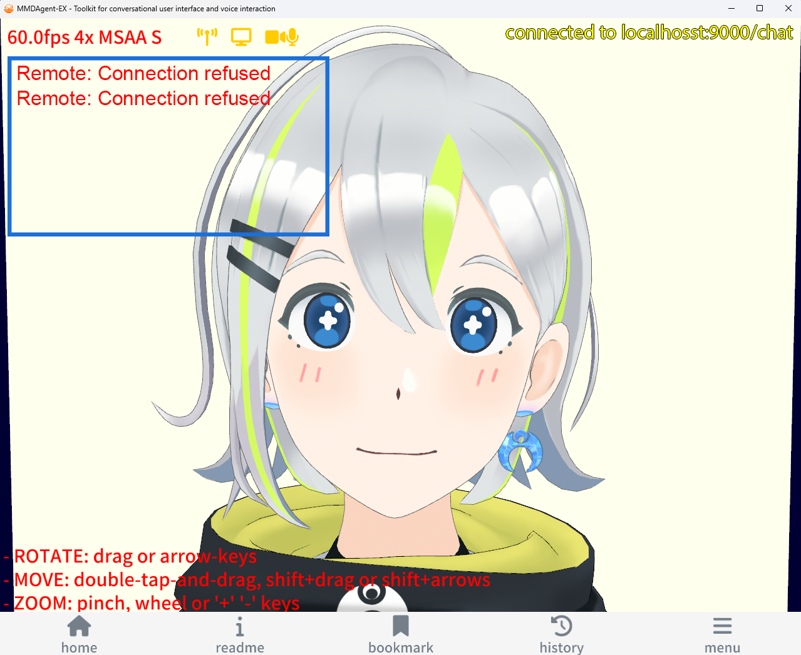
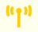

スクリーンショット：

### 青枠内：エラーメッセージ

エラー時に左上の青枠の部分にエラーメッセージが常時表示される

### 左上：動作状態

機能がONのときのみ表示されるものもある。`s` キーで ON/OFFできる。

- `60.0fps` 表示速度 (fps)
- `4x MSAA` アンチエイリアス (MSAA) 強度　大きいほど線が滑らかに表示されるが重くなる
- `[AL数字]` AutoLuminous (部位発光) の発効強度
- `S` 影表示： S = 投射影 SM =シャドウマップ(重め) なし=影なし
- `[DF数字|数字]` Diffusion Effect (拡散効果) の強度と範囲

### 中央上：通信状態

- : WebSocketサーバと接続状態
- : 画面のキャプチャをサーバへ伝送中
- : 音声およびWebカメラ映像をサーバへ伝送中

### 右上：通信ログ

接続・切断・リトライなど、ネットワーク状態が変更されたときメッセージが表示される。

### 左下：ヘルプ

操作状況に応じてヘルプやガイドを表示。上記サンプルは `c` キーでカメラ移動を可能な状態にしたとき

### 下：タブバー

- **home**: ホームコンテンツを開く
- **readme**: コンテンツの README を開く
- **bookmark**: ブックマークを開く
- **history**: 履歴を開く
- **menu**: メニューを開く

