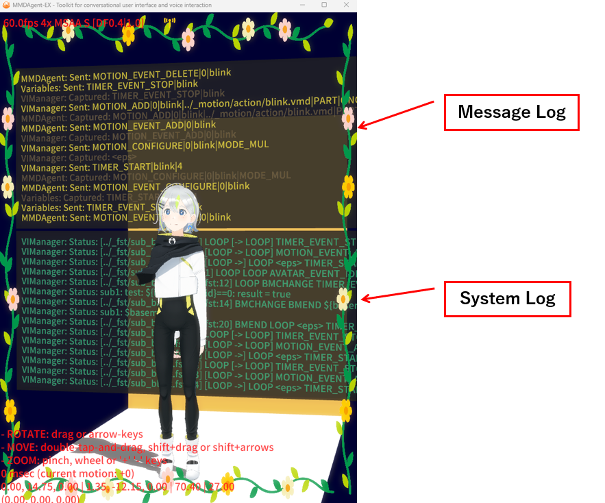
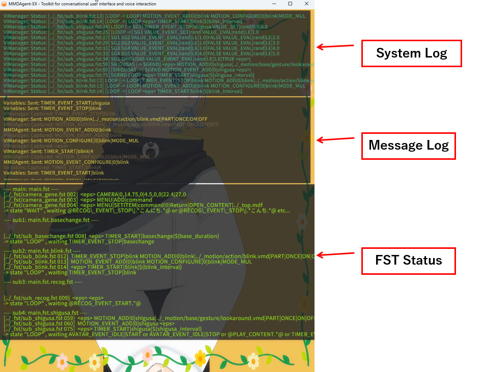

# ログ画面の見方

## 簡易ログ

`D` キーでシーン内に3Dでログが表示されます。（再度 `D` キーで消せます）

:

- **Message Log**: メッセージキューに流れたメッセージのログ
  - Sent: メッセージを発行したモジュール名とメッセージ内容
  - Captured: メッセージを受け取り処理を行ったモジュール名とメッセージ内容
- **System Log**: システムログ
  - FSTの遷移情報
  - ネットワーク状況
  - その他のシステムログ

## 詳細ログ

`Shift+F` キーで対話スクリプト（.fst）を含めた詳細なログが表示されます。ログは画面上にオーバーレイで表示されます。再度 `Shift+F` で消せます。

- **System Log**: システムログ（上記と同じ）
  - FSTの遷移情報の時系列
  - ネットワーク状況
  - その他のシステムログ
- **Message Log**: メッセージキューに流れたメッセージのログ（上記と同じ）
  - Sent: メッセージを発行したモジュール名とメッセージ内容
  - Captured: メッセージを受け取り処理を行ったモジュール名とメッセージ内容
- **FST Status**: 対話シナリオFSTファイルの状態表示（詳細ログにのみ表示）
  - FSTのファイル名、直前の遷移、現在の状態、次に待っているメッセージをリアルタイム更新
  - サブFST機能を使って複数のFSTを動かしているときは、FSTごとに表示
