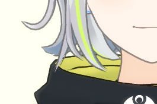
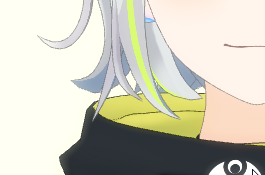
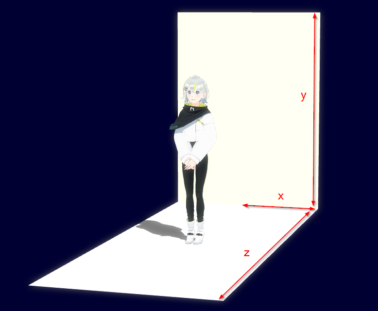
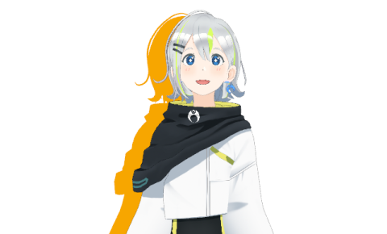

## しくみ

- MMDAgent-EXは.mdfファイルを指定してコンテンツを起動する
  - .mdf ファイルはコンテンツのトップディレクトリにある。
- .mdf ファイルの中身はテキストファイル。
  - MMDAgent-EXの動作パラメータを指定できる
- MMDAgent-EX の実行バイナリと同じディレクトリにある `MMDAgent-EX.mdf` はシステム設定
  - 全ての起動時に最初に読み込まれる
  - コンテンツの.mdfと設定が重なる場合、コンテンツ側が優先される
- `％ENV{名前}` のように記述することで任意の環境変数の値を取り込める。


## 注意事項

- 以下の一覧において、値は基本的にデフォルトの値
- 3D空間の座標はおおよそ 1.0 ≒ 8cm と考えてよい（MMDスケール）

# 設定項目一覧

## 入出力

ログをファイルに出力する。デフォルトは空白（＝出力しない）。

```text
log_file=
```

## プラグイン

プラグインの有効・無効を指定。

```text
disablePlugin=ALL
enablePlugin=Audio,VIManager
```

右辺の値は、以下の文字列が指定可能

- **`ALL`** : 全てのプラグインにマッチ
- **`NONE`** : 何にもマッチしない
- **プラグイン名**： `Plugins` ディレクトリ以下にある `Plugin_xxxx.dll` あるいは `Plugin_xxxx.so` の `xxxx` の部分の名前を指定。上記の例では Plugin_Audio.dll （あるいは.so）と Plugin_VIManger.dll（あるいは.so）のみ有効にしている。複数ある場合はカンマ区切りで。

評価は `enablePlugin` → `disablePlugin` の順でなされる。.mdf 内の記述順には関わらない。

例１：プラグイン `A`, `B`, `C` のみ有効でそれ以外は無効にする場合：

```text
enablePlugin=A,B,C
disablePlugin=ALL
```

例２：プラグイン `D`, `E` を無効にしてそれ以外は有効にする場合：

```text
disablePlugin=D,E
```

※ 以下の旧バージョンでの書き方（無効にするプラグインを1つずつ指定）も使える

```text
exclude_Plugin_Audio=yes
```

## ネットワーク

※ Plugin_Remote 利用時に有効

※ このセクションのみ値はデフォルト値ではなくサンプル値

### WebSocketサーバを使う場合

WebSocket の接続先のホスト名・ポート番号・パスを指定

```text
Plugin_Remote_Websocket_Host=localhost
Plugin_Remote_Websocket_Port=9000
Plugin_Remote_Websocket_Directory=/chat
```

### TCP/IP サーバ

TCP/IP クライアントになってサーバへ接続する場合

```text
Plugin_Remote_EnableClient=true
Plugin_Remote_Hostname=localhost
Plugin_Remote_Port=60001
```

TCP/IP サーバになる場合

```text
Plugin_Remote_EnableServer=true
Plugin_Remote_ListenPort=60001
```


### 共通の設定

接続失敗時に自動リトライする回数を指定（デフォルトは 0）

```text
Plugin_Remote_RetryCount=60
```


## 画面

ウィンドウの初期サイズ（横,縦）

```text
window_size=600,600
```

起動時にフルスクリーンにする（`F`キーで起動後に切り替え可能）

```text
full_screen=false
```

起動時に左上の動作状態を表示（`S`キーで起動後に切り替え可能）

```text
show_fps=true
```

## 3-Dモデル

いちどに表示するモデルの最大数。最小は1、最大は1024。

```text
max_num_model=10
```

トゥーンエッジの太さ（`K`, `Shift+K` で起動後に変更可能）




```text
cartoon_edge_width=0.35
```

スキニングに使用する並列スレッド数。通常はデフォルトの1で問題ないが、頂点数の多い巨大なモデルでレンダリングが遅くなってしまう場合は `2` や `4` を指定する。メッセージであとで変更できる。

```text
parallel_skinning_numthreads=1
```


## 視点（カメラ）

初期カメラパラメータ。上から順に位置、回転量(度)、カメラ距離、視野角(度)。

```text
camera_transition=0.0,13.0,0.0
camera_rotation=0.0,0.0,0.0
camera_distance=100.0
camera_fovy=16.0
```

## CG描画

アンチエイリアス (MSAA) 強度。大きいほど線が滑らかに表示されるが重くなる。0で機能をOFFにする。設定可能な最大値は 32。

```text
max_multi_sampling=4
```

背景画像と床画像の3D空間での大きさ。パラメータ(x,y,z)は x=幅の半分, y=背景の高さ, z=床の奥行。



```text
stage_size=25.0,25.0,40.0
```

キャンパスカラー（空間背景色） (R,G,B)

```text
campus_color=0.0,0.0,0.2
```

光源の到来方向 (x,y,z,w), 強さ (0.0～1.0)、色 (R,G,B) 。到来方向と色は起動後にメッセージでも変更可能。

```text
light_direction=0.5,1.0,0.5,0.0
light_intensity=0.6
light_color=1.0,1.0,1.0
```

ディフュージョンフィルター： `diffusion_postfilter=true` で有効化

※ Windows, Linux のみ　macOS では利用不可

```text
diffusion_postfilter=false
diffusion_postfilter_intensity=0.6
diffusion_postfilter_scale=1.0
```

## 影

起動時の影表示の初期設定（`Shift+S` で起動後に切り替え可能）

```text
use_shadow=true
```

起動時にシャドウマッピングをONにする（`X` で起動後に切り替え可能）

```text
use_shadow_mapping=false
```

Doppel Shadow エフェクトのON/OFF（デフォルトはOFF）とパラメータ



```text
# doppel shadow を on
doppel_shadow=true
# 二重影の色
doppel_shadow_color=r,g,b
# 二重影のオフセット
doppel_shadow_offset=x,y,z
# 影の濃さ（デフォルト 0.5）
shadow_density=0.5
```

## 物理演算

物理演算のシミュレーション解像度(fps)。30, 60, 120 が指定可能。値を小さくすると
処理が軽くなるが、剛体の抜けが生じやすくなる。

```text
bullet_fps=120
```

## 外部操作

外部操作中のリップシンクをリモート音声からマイク入力に切りかえる（`yes` 指定時）

```text
Plugin_Remote_EnableLocalLipsync=no
```

上記が `yes` のとき、さらに以下を `yes` を指定するとマイク入力を音声出力へパススルーする

```text
Plugin_Remote_EnableLocalPassthrough=no
```

リップシンクの音声を指定ディレクトリ以下に発話単位で録音する。録音時間の上限を分で指定可能（デフォルト: 120分）

```text
Plugin_Remote_Record_Wave_Dir=directory
Plugin_Remote_Record_Wave_Limit=120
```

**MOTIONCAPTURE_START** メッセージでモーションを保存する際の最大持続時間（単位：分）

```text
motion_capture_max_minutes=10
```

## その他の調整項目

### レンダリング関連

カートゥーンレンダリングを使用

```text
use_cartoon_rendering=true
```

MMD互換の色付けを使う

```text
use_mmd_like_cartoon=true
```

被選択モデルのエッジ色 (R,G,B,A、値は 0.0～1.0)

```text
cartoon_edge_selected_color=1.0,0.0,0.0,1.0
```

物理演算で y = 0 に床平面を入れるかどうか。

```text
bullet_floor=true
```

重力係数

```test
gravity_factor=10.0
```

モデルの内部コメントをロード時に表示する長さ（秒）。0で表示しない。

```text
display_comment_time=0
```

シャドウマッピング用テクスチャの一辺のサイズ

```text
shadow_mapping_texture_size=1024
``````

シャドウマッピング時にモデルに落とす影の濃さ

```text
shadow_mapping_self_density=1.0
``````

シャドウマッピング時に床に落とす影の濃さ

```text
shadow_mapping_floor_density=0.5
``````

シャドウマッピングのレンダリング順：true で明→暗、false で暗→明の順

```text
shadow_mapping_light_first=true
```

### 表示関連

ボタン定義時、ボタンを起動時に画面に表示（`Q`キーで起動後に切り替え可能）

```text
show_button=true
```

簡易ログ表示位置（サイズ・位置・スケール）

```text
log_size=80,30
log_position=-17.5,3.0,-20.0
log_scale=1.0
```

モーション再生タイミング微調整（単位：秒、最大値 10.0）

```text
motion_adjust_time=0.0
```

自動リップシンクで生成されるリップモーションの再生時の優先度

```text
lipsync_priority=100.0
```

### ユーザインタフェース関連

キー・マウス操作時の感度調整：カメラ回転・カメラ移動・距離・視野角

```text
rotate_step=4.5
translate_step=0.5
distance_step=4.0
fovy_step=1.0
```

`K`, `Shift+K` キーでエッジの太さを変更する際のステップ倍数

```text
cartoon_edge_step=1.2
```
