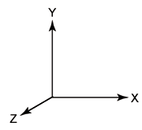
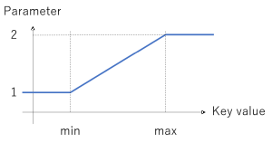
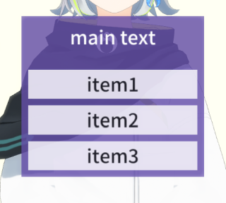

# メッセージ一覧

## 概要

MMDAgent の内部モジュールは Spoke and Hub 方式で接続されている

- あるモジュールから出力されたメッセージは全てのモジュールへブロードキャスト
- 全てのメッセージが全てのモジュールへ配信される
- 各モジュールは任意のメッセージに反応し、任意のメッセージを出力できる

以下、MMDAgent 本体およびプラグインモジュールで扱うメッセージの一覧。

文字コードは全て UTF-8 であること。

## 凡例

- "()" はパラメータの説明
- "x,y,z" は座標。MMDAgent は OpenGL ベースなので右手座標系。デフォルトは 0,0,0。

  

- "rx,ry,rz" は回転量（単位：度）。デフォルトは 0,0,0。
- "r,g,b" あるいは "r,g,b,a" は色指定。値は 0.0～1.0。
- "(A or B ...)" は選択。デフォルトはリストの最初の要素。

---

# 3Dモデル

## モデル追加・削除

**MODEL_ADD**

3Dモデルをシーンに追加する。親モデルを指定しない場合は世界座標に表示される。親モデルを指定するとそのモデルのボーンにマウントできる。終了時に **MODEL_EVENT_ADD** を発行する。

- 第1引数：モデルエイリアス（新規）
- 第2引数：モデルファイル名 .pmd
- 第3引数（省略可）：初期座標 デフォルト 0,0,0
- 第4引数（省略可）：初期回転量 デフォルト 0,0,0
- 第5引数（省略可）：トゥーンレンダリングの有無 デフォルト ON
- 第6引数（省略可）：親モデルのモデルエイリアス
- 第7引数（省略可）：親モデルのマウントするボーン名

```text
MODEL_ADD|(model alias)|(model file name)
MODEL_ADD|(model alias)|(model file name)|x,y,z
MODEL_ADD|(model alias)|(model file name)|x,y,z|rx,ry,rz
MODEL_ADD|(model alias)|(model file name)|x,y,z|rx,ry,rz|(ON or OFF for cartoon)
MODEL_ADD|(model alias)|(model file name)|x,y,z|rx,ry,rz|(ON or OFF for cartoon)|(parent model alias)
MODEL_ADD|(model alias)|(model file name)|x,y,z|rx,ry,rz|(ON or OFF for cartoon)|(parent model alias)|(parent bone name)
MODEL_EVENT_ADD|(model alias)
```

**MODEL_CHANGE, MODEL_CHANGE_ASYNC**

表示中のモデルを入れ替える。MODEL_CHANGE はモデルロードが終わるまで処理がブロックする。MODEL_CHANGE_ASYNC は非同期版で、メインスレッドをブロックせずに別スレッドで読み込みが行われる。モデルを入れ替え終わったタイミングで **MODEL_EVENT_CHANGE** を発行する。

```text
MODEL_CHANGE|(model alias)|(model file name)
MODEL_CHANGE_ASYNC|(model alias)|(model file name)
MODEL_EVENT_CHANGE|(model alias)
```

**MODEL_DELETE**

表示中のモデルを削除する。削除完了時に **MODEL_EVENT_DELETE** を発行する。


```text
MODEL_DELETE|(model alias)
MODEL_EVENT_DELETE|(model alias)
```

**MODEL_EVENT_SELECT**

モデルがダブルクリックで選択されたときに発行される。

```text
MODEL_EVENT_SELECT|(model alias)
```

## モーション再生

あらかじめ定義された一連の動作をモーションと呼ぶ。モーションはあるモデル上で複数同時に再生できる。

**MOTION_ADD**

モデルにモーションを追加し、再生を開始する。モーションごとにエイリアス名をつける。
完了時に**MOTION_EVENT_ADD**を発行する。

- 第1引数：対象のモデルエイリアス名
- 第2引数：モーションのエイリアス名（新規）
- 第3引数：モーションファイル名 .vmd
- 第4引数（省略可）：通常再生(FULL)か部分再生(PART)かを指定、デフォルトは FULL。
- 第5引数（省略可）：1回のみ(ONCE)か、ループ再生(LOOP)か、デフォルトは ONCE。
- 第6引数（省略可）：スムージングの ON / OFF、デフォルトは ON
- 第7引数（省略可）：開始時にモデル座標を強制変更 OFF / ON、デフォルトは OFF
- 第8引数（省略可）：モーション重ね時の優先度 デフォルトは 0

※ 部分再生(PART)を指定すると、モーションにおいて実際には動きが指定されていない（＝最初のフレーム（フレーム0）しかキーフレームが存在しない）ボーンが制御から除外される。

※ スムージングONの際はモーションが滑らかに開始・終了するよう冒頭と末尾でスムージングが行われる。切りたい場合 OFF を指定する。

※ 第7引数のモデル座標強制変更を ON にすると再生開始のタイミングでそのモデルの「センター」ボーンの座標位置をモデルのルート座標に強制変換する。通常は OFF でよい。

```text
MOTION_ADD|(model alias)|(motion alias)|(motion file name)
MOTION_ADD|(model alias)|(motion alias)|(motion file name)|(FULL or PART)
MOTION_ADD|(model alias)|(motion alias)|(motion file name)|(FULL or PART)|(ONCE or LOOP)
MOTION_ADD|(model alias)|(motion alias)|(motion file name)|(FULL or PART)|(ONCE or LOOP)|(ON or OFF for smooth)
MOTION_ADD|(model alias)|(motion alias)|(motion file name)|(FULL or PART)|(ONCE or LOOP)|(ON or OFF for smooth)|(OFF or ON for reposition)
MOTION_ADD|(model alias)|(motion alias)|(motion file name)|(FULL or PART)|(ONCE or LOOP)|(ON or OFF for smooth)|(OFF or ON for reposition)|priority
MOTION_EVENT_ADD|(model alias)|(motion alias)
```

**MOTION_CHANGE**

再生中のモーションを別のモーションに入れ替える。入れ替え完了時に **MOTION_EVENT_CHANGE** を発行する。

```text
MOTION_CHANGE|(model alias)|(motion alias)|(motion file name)
MOTION_EVENT_CHANGE|(model alias)|(model alias)
```

**MOTION_RESET**

再生中のモーションを初期フレームから再生しなおす。

```text
MOTION_RESET|(model alias)|(motion alias)
```

**MOTION_DELETE**

モーションの再生を中断して削除する。完了時に **MOTION_EVENT_DELETE** を発行する。

```text
MOTION_DELETE|(model alias)|(model alias)
MOTION_EVENT_DELETE|(model alias)|(motion alias)
```

**MOTION_ACCELERATE**

モーションの再生速度を指定したフレームに向かって徐々に変化させる。変化終了時に **MOTION_EVENT_ACCELERATE** を発行する。

- speed: 目標の再生速度。標準を 1.0 とした相対速度。0.0で停止。
- duration: 目標に向かって速度変化するのにかける時間（単位：秒）
- target: 目標とするモーション上のフレーム（単位：秒）

```text
MOTION_ACCELERATE|(model alias)|(motion alias)|(speed)|(duration)|(target)
MOTION_EVENT_ACCELERATE|(model alias)|(motion alias)
```

## モーション重ね合わせ調整

モーションを複数重ね合わせる場合の設定。重ね合わせ時、優先度低から高に向かって順にモーションが計算され、各モーションが対象とするボーンやモーフへ値がセットされるが、その際の挙動を設定できる。デフォルトは「上書き (replace)」だが、これを加算 (add) や無視 (none) にできる。指定はモーション単位で行えるが、さらに細かくボーン単位で指定することも可能。

**MOTION_CONFIGURE**

既存モーションに対して重ね合わせ時の動作設定を行う。

- 第1引数：モデルエイリアス
- 第2引数：モーションエイリアス
- 第3引数：設定ラベル（後述）
- 第4引数以降：パラメータ（設定ラベルに依存）

設定可能なラベルは以下のとおり。現在の値を rs, このモーションが指定する値を rd とする。rate を設定するとブレンド率を同時に設定できる。

- **MODE_REPLACE**: 上書き (rd)
- **MODE_ADD**: 加算 (rs + rd)
- **MODE_MUL**: モーフは乗算 (rs * rd)、ボーンは上書き
- **BLEND_RATE**: ブレンド率のみ設定（rd' = rd * ブレンド率）

```text
MOTION_CONFIGURE|(model)|(motion)|MODE_REPLACE
MOTION_CONFIGURE|(model)|(motion)|MODE_REPLACE|(rate)
MOTION_CONFIGURE|(model)|(motion)|MODE_ADD
MOTION_CONFIGURE|(model)|(motion)|MODE_ADD|(rate)
MOTION_CONFIGURE|(model)|(motion)|MODE_MUL
MOTION_CONFIGURE|(model)|(motion)|MODE_MUL|(rate)
MOTION_CONFIGURE|(model)|(motion)|BLEND_RATE|(rate)
```

ボーンごとに個別に指定するには：

- **MODE_BONE_REPLACE**: 指定ボーンを上書きに設定
- **MODE_BONE_ADD**: 指定ボーンを加算に設定
- **MODE_BONE_NONE**：指定ボーンを適用無し（スキップ）に設定
- **MODE_FACE_REPLACE**：指定モーフを上書きに設定
- **MODE_FACE_ADD**: 指定モーフを加算に設定
- **MODE_FACE_MUL**: 指定モーフを乗算に設定
- **MODE_FACE_NONE**: 指定モーフを適用無し（スキップ）に設定

```text
MOTION_CONFIGURE|(model alias)|(motion alias)|MODE_BONE_REPLACE|bonename[,bonename,..]
MOTION_CONFIGURE|(model alias)|(motion alias)|MODE_BONE_ADD|bonename[,bonename,..]
MOTION_CONFIGURE|(model alias)|(motion alias)|MODE_BONE_NONE|bonename[,bonename,..]
MOTION_CONFIGURE|(model alias)|(motion alias)|MODE_FACE_REPLACE|facename[,facename,..]
MOTION_CONFIGURE|(model alias)|(motion alias)|MODE_FACE_ADD|facename[,facename,..]
MOTION_CONFIGURE|(model alias)|(motion alias)|MODE_FACE_MUL|facename[,facename,..]
MOTION_CONFIGURE|(model alias)|(motion alias)|MODE_FACE_NONE|bonename[,bonename,..]
```

設定完了時に **MOTION_EVENT_CONFIGURE** を発行する。

```text
MOTION_EVENT_CONFIGURE|(model alias)|(motion alias)
```

## ボーン・モーフ個別制御

モーション以外の、モデルのボーンやモーフを外部から制御する方法。

**MODEL_BINDBONE**

ボーンに値をセットする。指定方法は固定値、KeyValue値にバインドの2種類がある。なお、そのボーンがモーションの制御下にある場合はモーション側が優先される。実行後に **MODEL_EVENT_BINDBONE** を発行する。値は即座に適用される。

- **固定値**：数値で移動量と回転量を指定。

```text
MODEL_BINDBONE|(model alias)|(bone name)|x,y,z|rx,ry,rz
```

- **KeyValue値バインド**: 設定以降、指定したKeyValue のキー値に対してリアルタイムに連動するようになる。

```text
MODEL_BINDBONE|(key name)|(min)|(max)|(model alias)|(bone name)|x1,y1,z1|rx1,ry1,rz1|x2,y2,z2|rx2,ry2,rz2
```

指定した部位のパラメータ値は、KeyValue 値の変化に伴って、与えた2つの指定パラメータ間で以下のように決定される。



**MODEL_BINDFACE**

モーフの値をセットする。ボーンと同様に、指定方法は固定値とKeyValue値バインドの2種類がある。そのモーフがモーション影響下にある場合はモーション側が優先される。終了時に **MODEL_EVENT_BINDFACE** を発行する。

- **固定値**：数値で変化量を指定。値は即座に適用される。`transition_duration` を指定したときは指定された時間だけかけてゆっくり変化する。

```text
MODEL_BINDFACE|(model alias)|(morph name)|(value)`
MODEL_BINDFACE|(model alias)|(morph name)|(value)|(transition_duration)`
```


- **KeyValue値バインド**: 設定以降、指定したKeyValue のキー値に対してリアルタイムに連動するようになる。設定実行後に **MODEL_EVENT_BINDBONE** が発行される。

```text
MODEL_BINDFACE|(key name)|(min)|(max)|(model alias)|(face name)|rate1|rate2
```

**MODEL_UNBINDBONE**

指定ボーンのバインドを解除する。終了時に **MODEL_EVENT_UNBINDBONE** を発行する。

```text
MODEL_UNBINDBONE|model alias|bone name
MODEL_EVENT_UNBINDBONE|model alias|bone name
```

**MODEL_UNBINDFACE**

指定モーフのバインドを解除する。終了時に **MODEL_EVENT_UNBINDFACE** を発行する。

## モデルの表示位置移動

以下、座標指定において `GLOBAL` はワールド座標系で、`LOCAL` はモデル座標系で指定する。

**MOVE_START, MOVE_STOP**

指定座標へモデルをなめらかに移動させる。MOVE_STOP で移動を中断可能。移動開始時に **MOVE_EVENT_START**, 移動終了あるいは中断時に **MOVE_EVENT_STOP** を発行する。

move speed を指定するとその速度（距離/秒）で指定座標まで定速移動する。


```text
MOVE_START|(model alias)|x,y,z
MOVE_START|(model alias)|x,y,z|(GLOBAL or LOCAL position)
MOVE_START|(model alias)|x,y,z|(GLOBAL or LOCAL position)|(move speed)
MOVE_STOP|(model alias)
MOVE_EVENT_START|(model alias)
MOVE_EVENT_STOP|(model alias)
```

**TURN_START, TURN_STOP**

指定した座標が正面となるようモデルを回転する。TURN_STOP で途中中断可能。回転開始時に **TURN_EVENT_START**, 終了あるいは中断時に **TURN_EVENT_STOP** を発行する。

rotation speed を指定するとその速度（度/秒）で定速回転する。

```text
TURN_START|(model alias)|x,y,z
TURN_START|(model alias)|x,y,z|(GLOBAL or LOCAL position)
TURN_START|(model alias)|x,y,z|(GLOBAL or LOCAL position)|(rotation speed)
TURN_STOP|(model alias)
TURN_EVENT_START|(model alias)
TURN_EVENT_STOP|(model alias)
```

**ROTATE_START, ROTATE_STOP**

指定した回転量だけモデルを回転する。ROTATE_STOP で途中中断可能。回転開始時に **ROTATE_EVENT_START**, 終了あるいは中断時に **ROTATE_EVENT_STOP** を発行する。

rotation speed を指定するとその速度（度/秒）で定速回転する。

```text
ROTATE_START|(model alias)|rx,ry,rz
ROTATE_START|(model alias)|rx,ry,rz|(GLOBAL or LOCAL rotation)
ROTATE_START|(model alias)|rx,ry,rz|(GLOBAL or LOCAL rotation)|(rotation speed)
ROTATE_STOP|(model alias)
ROTATE_EVENT_START|(model alias)
ROTATE_EVENT_STOP|(model alias)
```

## テクスチャアニメーションの実行

**TEXTURE_SETANIMATIONRATE**

アニメーションPNG (APNG) テクスチャのアニメーション速度をテクスチャごとに変更。

- `textureFileName` はモデル内のテクスチャ指定文字列と一致させる。
- `rate` は 1.0 で標準、0.5だと半分、2.0だと倍速。0.0で停止。

```text
TEXTURE_SETANIMATIONRATE|model alias|textureFileName|rate
```

## 並列スキニング設定

**CONFIG_PARALLELSKINNING_THREADS**

並列スキニングにつかうスレッド数を変更する。1から4の範囲で指定可能、デフォルトは .mdf で設定した値。

※ 動作中の並列スレッド数変更のためシステムが不安定になる可能性がある。うまく動かないようなら .mdf の `parallel_skinning_numthreads=2` のほうで起動時に指定するのを推奨する。

```text
CONFIG_PARALLELSKINNING_THREADS|2
```

## モーションをファイルにキャプチャ

**MOTIONCAPTURE_START, MOTIONCAPTURE_STOP**

モデルの動作をモーションファイル (.vmd) としてキャプチャ記録する。

```text
MOTIONCAPTURE_START|model alias|filename.vmd
MOTIONCAPTURE_STOP|model alias
```

# 画面構成

## 視点（カメラ）

**CAMERA**

視点を変更する。3つの指定方法がある。

**数値で指定**：`x,y,z|rx,ry,rz|(distance)|(fovy)` でパラメータを指定する。これらの値は `D` キーで簡易ログを表示したときに左下に出てくる値で設定できる。Transition time period は指定した視点までどう変化するかを指定。デフォルト（-1）は滑らかに視点移動、0で即座にジャンプ、0より大きい値でその秒数をかけて指定座標まで定速移動。

```text
CAMERA|x,y,z|rx,ry,rz|(distance)|(fovy)
CAMERA|x,y,z|rx,ry,rz|(distance)|(fovy)|(transition time period)
```

**モデルにマウント**: モデルの動きにカメラの動きをリアルタイムに追従させる。ボーン名を指定しない場合は「センター」ボーンに追従する。

```text
CAMERA|x,y,z|rx,ry,rz|(distance)|(fovy)|(transition time period)|(model alias)
CAMERA|x,y,z|rx,ry,rz|(distance)|(fovy)|(transition time period)|(model alias)|(bone name)
```

**モーションで指定**：カメラの動きをあらかじめ定義したカメラモーションファイル（.vmd）を指定して動作開始

```text
CAMERA|(camera motion file name)
```

## 背景・床

**STAGE**

背景・床の画像、あるいはステージ用の3Dモデルの指定・変更。背景・床の表示サイズは .mdf の `stage_size` で指定。画像は指定サイズにフィットするよう伸長される。

```text
STAGE|(floor image file),(back image file)
STAGE|(stage file .xpmd or .pmd)
```

## 前景・フレーム

**WINDOWFRAME**

画面の一番上にフレーム画像 (.png) を重ね表示する。画像は画面の縦横比に合わせて伸長される。


```text
WINDOWFRAME|filename.png
```

## 光源

**LIGHTCOLOR**

光源の到来方向と色を変更。

```text
LIGHTDIRECTION|x,y,z
LIGHTCOLOR|r,g,b
```

# テキスト・画像の表示

## テキスト・画像・カメラ映像を表示

任意のテキスト、画像、あるいはライブカメラ映像を3D空間内に表示する。

手順は、まず **TEXTAREA_ADD** で表示エリアを定義して、**TEXTAREA_SET** でそこに表示する内容を指定する。 **TEXTAREA_SET** を繰り返すことで同じ場所で内容を変えていける。

**TEXTAREA_ADD**

エリアを新たに追加。大きさ、色、座標、向きを指定する。座標はエリアの中心点で指定。親モデル指定でそのモデルに「載せる」ことが可能。

追加が完了した時点で **TEXTAREA_EVENT_ADD** が発行される。

- 第1引数：エイリアス名（新規）
- 第2引数：幅と高さ
  - 正の値：固定サイズ（内容がはみ出す場合、収まるよう縮小される）
  - 0：可変サイズ：内容に従って自動調整される。画像の場合縦横比は保持される。
- 第3引数：文字の大きさ、マージン、行間。それぞれ 1.0 が基本。
- 第4引数：背景色 r,g,b,a　a = 0 で背景無し
- 第5引数：文字色 r,g,b,a
- 第6引数：中心の座標
- 第7引数（省略可）：向き（回転量）
- 第8引数（省略可）：親モデルのモデルエイリアス
- 第9引数（省略可）：親モデルのマウントするボーン名（省略時は「センター」を使う）

```text
TEXTAREA_ADD|(textarea alias)|(width,height)|(size,margin,exlinespace)|r,g,b,a|r,g,b,a|x,y,z
TEXTAREA_ADD|(textarea alias)|(width,height)|(size,margin,exlinespace)|r,g,b,a|r,g,b,a|x,y,z|rx,ry,rz
TEXTAREA_ADD|(textarea alias)|(width,height)|(size,margin,exlinespace)|r,g,b,a|r,g,b,a|x,y,z|rx,ry,rz|(parent model alias)
TEXTAREA_ADD|(textarea alias)|(width,height)|(size,margin,exlinespace)|r,g,b,a|r,g,b,a|x,y,z|rx,ry,rz|(parent model alias)|(parent bone name)
TEXTAREA_EVENT_ADD|alias
```

**TEXTAREA_SET**

エリアに文字あるいは画像を表示する。表示開始時に **TEXTAREA_EVENT_SET** が発行される。既に表示されている場合は入れ替える。

表示内容は第2引数で指定：

- **文字列を記述**すると、その文字列を表示。空白を含む場合は文字列を "" で囲む。"\n" で改行もできる。
- **画像ファイルのパスを記述**すると、その画像を表示。

```text
TEXTAREA_SET|(textarea alias)|(string or image path)
TEXTAREA_EVENT_SET|alias
```

**TEXTAREA_DELETE**

エリアを削除し表示を消す。削除完了時に **TEXTAREA_EVENT_DELETE** が発行される。

```text
TEXTAREA_DELETE|(textarea alias)
TEXTAREA_EVENT_DELETE|alias
```

## テキストキャプション

テキストキャプションを表示する。上記の TextArea との違い:

- 3D空間上ではなくオンスクリーン表示（視点に寄らず一定位置に表示）
- 任意のフォントを指定可能
- 文字の縁取りが２種まで指定可能
- 指定時間経過後に自動で消えるよう指定可能


**CAPTION_SETSTYLE**

スタイルを定義。定義後に **CAPTION_EVENT_SETSTYLE** を発行する。

- 第1引数：スタイルのエイリアス名（新規）
- 第2引数：フォントファイルのパス "default" でシステムフォントを利用
- 第3引数：文字の色 r,g,b,a
- 第4引数：1つ目の縁取りの色および大きさ r,g,b,a,thickness 縁取り不要の場合は a あるいは thinkness を 0 に
- 第5引数：2つ目の縁取りの色および大きさ 指定は上記と同様
- 第6引数：枠背景の色 r,g,b,a不要な場合は a に 0 を指定

```text
CAPTION_SETSTYLE|style_alias|fontpath|r,g,b,a|edge1|edge2|basecolor
CAPTION_EVENT_SETSTYLE|style_alias
```

**CAPTION_START**

テキスト表示開始。スタイルを指定する。指定エイリアス名のテキスト表示が既にある場合は変更される。**CAPTION_STOP** あるいは `duration` で指定した時間が経過すれば消える。

- 第1引数：エイリアス名（新規）
- 第2引数：使用する定義済みスタイルのエイリアス名
- 第3引数：表示内容のテキスト。空白を含む場合は ""で囲む。"\n" で改行もできる。
- 第4引数：文字の大きさ
- 第5引数：表示の左右位置 CENTER, LEFT, RIGHT のいずれかの文字列を指定
- 第6引数：表示の上下位置 画面の一番下を 0.0、一番上を 1.0 とした相対値
- 第7引数：表示持続時間をフレーム数で（30=1秒）

```text
CAPTION_START|alias|style_alias|text|size|align|height|duration
CAPTION_EVENT_START|alias
CAPTION_EVENT_STOP|alias
```

使用例：

```text
# "1" キーでキャプションをテスト表示
# フォントファイルは rounded-mplus-1c-heavy.ttf を使う。
# テキスト色：オレンジ
# エッジ１：白、太さ４
# エッジ２：黒半透明、太さ６
# 枠背景：描画なし
10 10:
    KEY|1 CAPTION_SETSTYLE|terop|rounded-mplus-1c-heavy.ttf|1,0.5,0,1|1,1,1,1,4|0,0,0,0.6,6|0,0,0,0
    CAPTION_EVENT_SETSTYLE|terop CAPTION_START|test|terop|てすと|3.0|CENTER|0.5|300
```

**CAPTION_STOP**

表示中のテキストを強制削除する。成功時に **CAPTION_EVENT_STOP** を発行する。

```text
CAPTION_STOP|alias
CAPTION_EVENT_STOP|alias
```

## テキストプロンプトを提示しユーザの回答を得る

**PROMPT_SHOW**

メッセージダイアログを表示して、ユーザに選択させる。指定するテキストが空白を含む場合は "" でくくる。

```text
PROMPT_SHOW|(main text)|(item text 0)|(item text 1)|...
```

例：

```text
PROMPT_SHOW|"main text"|item1|item2|item3
```



ユーザがいずれかの項目を選択したら、**PROMPT_EVENT_SELECTED** が選択されたアイテムの番号 (0～）とともに発行され、このダイアログは消える。選択をキャンセル（ダイアログ外をクリックあるいは ESC キー）された場合は -1 が返る。

```text
PROMPT_EVENT_SELECTED|(selected number or -1 for cancel)
```

## ドキュメントを全画面表示しユーザの反応を得る

**INFOTEXT_FILE**

テキストファイルの中身をフルスクリーンで画面表示する。表示開始時に **INFORTEXT_EVENT_SHOW** が発行される。

- 第1引数：テキストファイルのパス
- 第2引数：タイトルラベル
- 第3引数：選択ボタンラベル カンマで区切る 例："Yes,No,Cancel"
- 第4引数（省略可）：文字スケール（デフォルト：1.0）
- 第5引数（省略可）：背景色 "RRGGBBAA" の16進数で 例：白=FFFFFFFF
- 第6引数（省略可）：文字色 同上

表示された文書はドラッグ（スワイプ）でスクロール可能。

下部に第3引数で指定したラベルが表示される。ユーザがいずれか選択すると、表示が終了し、**INFORTEXT_EVENT_CLOSE** が押されたボタンのインデックスとともに発行される。

例： README.txt を表示

```text
INFOTEXT_FILE|README.txt|"read me"|OK,NO
```


```text
INFOTEXT_FILE|(filepath)|(titleLabel)|(buttonLabels)
INFOTEXT_FILE|(filepath)|(titleLabel)|(buttonLabels)|(scale)
INFOTEXT_FILE|(filepath)|(titleLabel)|(buttonLabels)|(scale)|(BACKGROUNDCOLOR)|(TEXTCOLOR)
INFOTEXT_EVENT_SHOW
INFOTEXT_EVENT_CLOSE|(selecteDButtonLabel)
```


**INFOTEXT_STRING**

文字列を直接指定して、フルスクリーンで画面に表示する。

- 第1引数：テキストの内容（文字列）
- 第2引数：タイトルラベル
- 第3引数：選択ボタンラベル 例："Yes,No,Cancel"
- 第4引数（省略可）：文字スケール（デフォルト：1.0）
- 第5引数（省略可）：背景色 "RRGGBBAA" の16進数で 例：白=FFFFFFFF
- 第6引数（省略可）：文字色 同上

選択ボタンラベルは画面下部に現れるボタン。カンマで区切って複数指定可能。どれかが押されたら表示が終了する。

表示完了時に **INFORTEXT_EVENT_SHOW**, ボタンが選択されて表示が終了したときに **INFORTEXT_EVENT_CLOSE** が押されたボタンのインデックスとともに発行される。

```text
INFOTEXT_STRING|textbody|(titleLabel)|(buttonLabels)
INFOTEXT_STRING|textbody|(titleLabel)|(buttonLabels)|(scale)
INFOTEXT_STRING|textbody|(titleLabel)|(buttonLabels)|(scale)|(BACKGROUNDCOLOR)|(TEXTCOLOR)
INFOTEXT_EVENT_SHOW
INFOTEXT_EVENT_CLOSE|(selecteDButtonLabel)
```

# オーディオ

## サウンド再生

**SOUND_START**

サウンドファイルの再生を開始する。mp3, wav が使用可能。再生開始時に **SOUND_EVENT_START** が、終了時に **SOUND_EVENT_STOP** がそれぞれ発行される。

```text
SOUND_START|(sound alias)|(sound file name)
SOUND_EVENT_START|(sound alias)
SOUND_EVENT_STOP|(sound alias)
```

**SOUND_STOP**

再生中のサウンドを強制中断する。中断時に **SOUND_EVENT_STOP** が発行される。

```text
SOUND_STOP|(sound alias)
SOUND_EVENT_STOP|(sound alias)
```

## 音声再生 with リップシンク

**SPEAK_START**

音声ファイルを指定モデルに喋らせる。再生と同時にリップシンクが行われる。再生開始時に **SPEAK_EVENT_START** が、再生終了時に **SPEAK_EVENT_STOP** が発行される。.shapemap 設定が必要。

```text
SPEAK_START|(model alias)|(audio file)
SPEAK_EVENT_START|(model alias)
SPEAK_EVENT_STOP|(model alias)
```

## 音声認識

使用するモジュールやプラグインによってメッセージの内容は変わる。

### 共通

**RECOG_EVENT_START**

音声入力の開始時に発行されるメッセージ

```text
RECOG_EVENT_START
```

**RECOG_EVENT_STOP**

音声認識結果が得られたときに発行されるメッセージ

```
RECOG_EVENT_STOP|認識結果の文字列
```

### MS版音声認識モジュール（msasr）

MSASR_DEACTIVATE で実行中の音声認識モジュールを一時停止。MSASR_ACTIVATE で再開。
一時停止中の入力音声は無視される。

```text
MSASR_DEACTIVATE
MSASR_ACTIVATE
```

### Plugin_Julius （OBSOLETE)

**RECOG_EVENT_OVERFLOW**

音声入力のレベルが大きすぎて音割れしているときに発行されるメッセージ

```text
RECOG_EVENT_OVERFLOW
```

**RECOG_EVENT_GMM**

GMMによる音声識別を行っているときに出力されるメッセージ

```
RECOG_EVENT_GMM
```

**RECOG_RECORD_START, RECOG_RECORD_STOP**

Julius が録音を開始・中断した時に発行されるメッセージ

```text
RECOG_RECORD_START|directory
RECOG_RECORD_STOP
```

**RECOG_EVENT_AWAY**

Away notification:

```text
RECOG_EVENT_AWAY|ON
RECOG_EVENT_AWAY|OFF
```

**RECOG_MODIFY**

認識エンジンへパラメータをセットするメッセージ

```text
RECOG_MODIFY|GAIN|scaling_value
RECOG_EVENT_MODIFY|GAIN
RECOG_MODIFY|CHANGE_CONF|jconf_file
RECOG_EVENT_MODIFY|CHANGE_CONF
RECOG_MODIFY|USERDICT_SET|(dictionary file path)
RECOG_EVENT_MODIFY|USERDICT_SET
RECOG_MODIFY|USERDICT_UNSET
RECOG_EVENT_MODIFY|USERDICT_UNSET
```

## 音声合成

使用するモジュールやプラグインによってメッセージの内容は変わる。

### 共通

**SYNTH_START**

音声合成を開始する。指定したモデルが発声に合わせてリップシンクする。合成音声が出力され始めるときに **SYNTH_EVENT_START** が発行され、出力が終了したときに **SYNTH_EVENT_STOP** が発行される。

```text
SYNTH_START|(model alias)|(voice alias)|(synthesized text)
SYNTH_EVENT_START|(model alias)
SYNTH_EVENT_STOP|(model alias)
```

**SYNTH_STOP**

出力中の音声合成を強制中断する。中断したときに **SYNTH_EVENT_STOP** が発行される。

```text
SYNTH_STOP|(model alias)
SYNTH_EVENT_STOP|(model alias)
```

### Plugin_Open_JTalk

Japanese speech synthesis engine.

```text
LIPSYNC_START|(model alias)|(phoneme and millisecond pair sequence)
LIPSYNC_STOP|(model alias)
LIPSYNC_EVENT_START|(model alias)
LIPSYNC_EVENT_STOP|(model alias)
```

# 外部操作 (Plugin_Remote)

## 制御・操作

**AVATAR|START, AVATAR|STOP**

外部制御APIからモデルの外部制御を開始するコマンドである `__AV_START` あるいは終了コマンド `__AV_END` を受信したときにそれぞれ発行されるメッセージ。

```text
AVATAR|START
AVATAR|END
```

**AVATAR_CONTROL**

外部制御APIからのコマンドに基づいてモデルを制御するのを一時的に中断・再開する。処理後に **AVATAR_EVENT_CONTROL** を発行する。

- **DISABLE**: 一時的に無効化
- **ENABLE**: 無効化を終了して再開

```text
AVATAR_CONTROL|DISABLE
AVATAR_EVENT_CONTROL|DISABLED
AVATAR_CONTROL|ENABLE
AVATAR_EVENT_CONTROL|ENABLED
```

**REMOTEKEY_CHAR, REMOTEKEY_DOWN, REMOTEKEY_UP**

キーボード入力を外部から送りこむメッセージ。

```text
REMOTEKEY_CHAR|(character)
REMOTEKEY_DOWN|(key code string)
REMOTEKEY_UP|(key code string)
```

## 操作ログ記録

**AVATAR_LOGSAVE_START, AVATAR_LOGSAVE_STOP**

外部からの制御コマンドを全てファイルに記録する。**AVATAR_LOGSAVE_START**で開始、**AVATAR_LOGSAVE_STOP**で終了。

```text
AVATAR_LOGSAVE_START|ファイル名
AVATAR_LOGSAVE_STOP
```

# イベント通知

## 現在時刻

**CURRENT_TIME**

現在時刻を表すメッセージ。30秒ごとにシステムから発行される。

```text
CURRENT_TIME|hh|mm
```

## キー入力・マウスクリック

**DRAGANDDROP**

ユーザがファイルをドラッグアンドドロップしたときに発行されるメッセージ。

```text
DRAGANDDROP|(file name)
```

**KEY**

ユーザがキーを押したときに発行されるメッセージ。

```text
KEY|(key name)
```

**TAPPED**

ユーザがマウスクリックあるいはタップしたときに発行されるメッセージ。

```text
TAPPED|x|y
```

**SCREEN_EVENT_LONGPRESSED, SCREEN_EVENT_LONGRELEASED**

ユーザが画面を長押ししたときに発行されるメッセージ。`xxxxx_yyyyy_wwwww_hhhhh` は長押しされた座標を表す。`(x,y)` はスクリーン上の長押しされた座標、`(w,h)` はスクリーンの幅と高さで、単位はピクセル。

```text
SCREEN_EVENT_LONGPRESSED|xxxxx_yyyyy_wwwww_hhhhh
SCREEN_EVENT_LONGRELEASED|xxxxx_yyyyy_wwwww_hhhhh
```

# 変数

## 変数

**VALUE_SET**

変数に値をセット。指定した範囲でランダムな数値をセットすることもできる。
セット完了時に **VALUE_EVENT_SET** を発行する。

```text
VALUE_SET|(variable alias)|(value)
VALUE_SET|(variable alias)|(minimum value for random)|(maximum value for random)
VALUE_EVENT_SET|(variable alias)
```

**VALUE_UNSET**

変数を削除。完了時に **VALUE_EVENT_UNSET** を発行する。

```text
VALUE_UNSET|(variable alias)
VALUE_EVENT_UNSET|(variable alias)
```

**VALUE_EVAL**

変数を数値とみなして大小を評価。結果を **VALUE_EVENT_EVAL** で発行する。

```text
VALUE_EVAL|(variable alias)|(EQ or NE or LE or LT or GE or GT for evaluation)|(value)
VALUE_EVENT_EVAL|(variable alias)|(EQ or NE or LE or LT or GE or GT for evaluation)|(value)|(TRUE or FALSE)
```

## カウントダウンタイマー

**TIMER_START**

タイマー変数を開始する。値は秒で、0.1 秒が最小解像度。

- タイマーが開始したとき **TIMER_EVENT_START** を発行する
- 指定時間が経過したら **TIMER_EVENT_STOP** を発行、そのタイマー変数は削除される。
- 同名のタイマー変数が既に存在する場合、
  - **TIMER_EVENT_CANCELLED** を発行する
  - 値を上書きする
  - **TIMER_EVENT_START** を発行する

```text
TIMER_START|(count down alias)|(value)
TIMER_EVENT_START|(count down alias)
TIMER_EVENT_STOP|(count down alias)
TIMER_EVENT_CANCELLED|(count down alias)
```

**TIMER_STOP**

動作中のタイマー変数をストップする。

- タイマー変数が存在する場合、 **TIMER_EVENT_STOP** を発行
- タイマー変数が存在しない場合は何もしない（ワーニングを出力するのみ）

```text
TIMER_STOP|(count down alias)
TIMER_EVENT_STOP|(count down alias)
```

**TIMER_CANCEL**

タイマー変数を強制的に中断・削除する。

- 指定したタイマー変数が存在する場合、削除して **TIMER_EVENT_CANCEL** を発行
- 指定したタイマー変数が存在しない場合も **TIMER_EVENT_CANCEL** を発行

```text
TIMER_CANCEL|(count down alias)
TIMER_EVENT_CANCELLED|(count down alias)
```

## KeyValue値のセット

**KEYVALUE_SET**

このメッセージを発行することで KeyValue 値をセットできる。

```text
KEYVALUE_SET|(key name)|(value)
```

# 連携

## 他のコンテンツを開く

**OPEN_CONTENT**

現コンテンツを終了し、新たに指定された .mdf を開く。

```text
OPEN_CONTENT|relative_mdf_path
```

**FST_LOAD**

現在実行中のFSTを破棄し、指定したFSTを読み込んで開始する。

```text
FST_LOAD|(.fst file path)
FST_LOAD|(.fst file path)|(initial state label)
```

## ホームの強制セット

**HOME_SET**

カレントコンテンツをホームにセット

```text
HOME_SET
```

**HOME_CLEAR**

ホームの設定をクリア

```text
HOME_CLEAR
```


## アプリ連携

**EXECUTE**

指定したファイルを実行する（Windowsのみ）

```text
EXECUTE|(file name)
```

**KEY_POST**

指定したアプリケーションへキーイベントを送る（Windowsのみ）

```text
KEY_POST|(window class name)|(key name)|(ON or OFF for shift-key)|(ON or OFF for ctrl-key)|(On or OFF for alt-key)
```

## ファイルダウンロード

**NETWORK_GET**

ファイルをダウンロードする。完了時に **NETWORK_EVENT_GET** を発行する。

```text
NETWORK_GET|(net alias)|(URI)|(save file name)
NETWORK_EVENT_GET|(net alias)
```

# ユーザインタフェース

## ボタン表示

**BUTTON_ADD**

ボタンを画面上に追加する。表示の完了後に **BUTTON_EVENT_ADD** を発行する。

- 第1引数：エイリアス名（新規）
- 第2引数：表示スケール
- 第3引数：表示位置 x,y　正の値は左(下)から、負の値は右(上)からの距離
- 第4引数：画像ファイル
- 第5引数：アクション（"play", "open", "message", "keyvalueset"...）
- 第6引数：押下後処理（ON=表示消し OFF=表示キープ）

```text
BUTTON_ADD|alias|scale|x,y|image path|action|(ON or OFF for autoclose)
BUTTON_EVENT_ADD|alias
```

**BUTTON_DELETE**

ボタンを削除する。削除の完了後に **BUTTON_EVENT_DELETE** を発行する。

```text
BUTTON_DELETE|alias
BUTTON_EVENT_DELETE|alias
```

**BUTTON_EVENT_EXEC**

ボタンがクリック（タップ）されたときに発行される。

```text
BUTTON_EVENT_EXEC|alias
```

## メニュー追加

**MENU|ADD**

メニューに新たにページを追加する。デフォルトと合わせて最大20ページまで可能。追加完了時に **MENU_EVENT|ADD** を発行する。

```text
MENU|ADD|(alias)
MENU|ADD|(alias)|backgroundImagePath
MENU_EVENT|ADD|(alias)
```

**MENU|SETITEM**

メニューの指定ページの指定位置に項目を登録する。`id` は0から始まる項目番号。1ページあたり項目は30個まで登録可能。登録完了後に **MENU_EVENT|SETITEM** を発行する。

```text
MENU|SETITEM|(alias)|(id)|(label)|(type)|(arg1)|(arg2)|...
MENU_EVENT|SETITEM|(alias)|(id)
```

**MENU|DELETEITEM**

メニューの指定ページの指定位置の項目内容を削除する。削除完了時に **MENU_EVENT|DELETEITEM** を発行する。

```text
MENU|DELETE|(alias)
MENU_EVENT|DELETE|(alias)
```

**MENU|DELETE**

メニューの指定ページをまるごど削除する。削除完了時に **MENU_EVENT|DELETE** を発行する。

```text
MENU|DELETEITEM|(alias)|(id)
MENU_EVENT|DELETEITEM|(alias)|(id)
```
